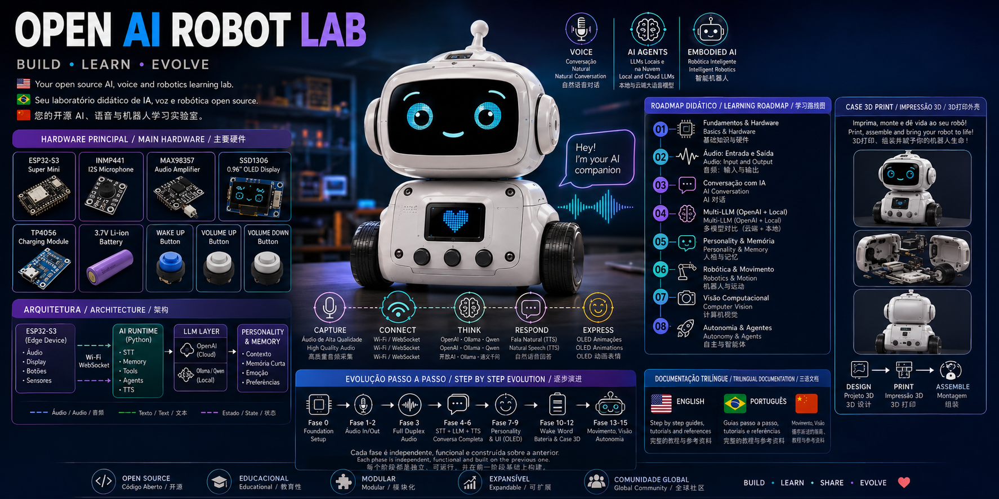

# Open AI Robot Lab

Build • Learn • Evolve

An open source educational laboratory focused on:
- AI
- Voice interfaces
- ESP32 robotics
- Hybrid LLM architectures
- Embedded systems
- 3D printed robotics

## Main Components

- ESP32-S3 Super Mini
- INMP441 I2S Microphone
- MAX98357 Audio Amplifier
- SSD1306 OLED Display
- TP4056 Charging Module
- 3.7V Li-ion Battery

## Project Goals

- Step-by-step educational learning
- Progressive phases without breaking previous stages
- Multilingual documentation
- OpenAI + Local LLM comparison
- 3D printable robotic platform

## Languages

- English
- Português (Brasil)
- 中文（简体）

## Initial Roadmap

1. Foundation Setup
2. Audio Input
3. Audio Output
4. Full Duplex Audio
5. STT + LLM
6. TTS
7. Personality Runtime
8. Multi-LLM Architecture
9. OLED UI
10. 3D Printed Robot Case

## Repository Structure

```
firmware/
ai-runtime/
hardware/
mechanics/
docs/
benchmarks/
examples/
media/
```
